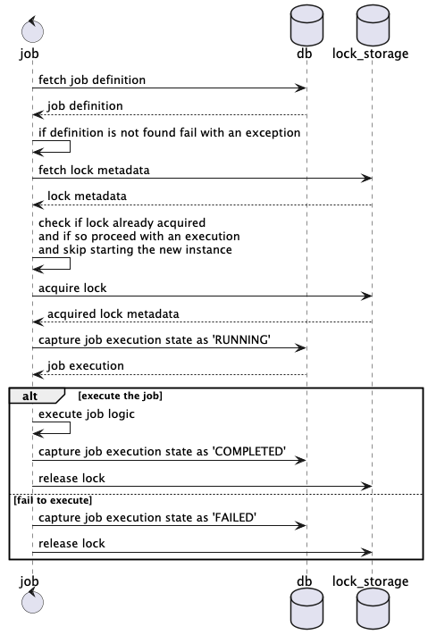

# Jobs Toolkit

A tiny job API which is supposed to provide a very simple and lightweight scheduled job capability. A simple yet
intuitive and declarative Java API which allows you to build complex jobs much easier and faster.
Platform agnostic Java API which could be used in any application no matter what platform it would be.

Available in both free Open Source and enterprise editions.

You can find a full list of enterprise features in the [enterprise README](./enterprise.md). Elevate your experience
with all the available features that are needed for your team and project.
Reduce your time for a repetitive data persistence and much more... solution design and coding.

Starting price upon negotiation. Feel free to contact me [directly](mailto:sergei.visotsky@gmail.com).

## Architecture

The following is a sequence of how the job is being executed underneath:



Database tables `job_definition`, `job_execution`, `lock_metadata` are used to store job definitions, executions and
lock information respectively.
* job_definition - contains job definitions, such as job name and its description
* job_execution - contains job executions, such as job name, last run time and the state of the last run
* lock_metadata - contains lock information, such as job name, lock status and the time when the lock was acquired

The job itself is a distributed lock based what means that it could be easily used in a distributed system.
That will allow to avoid race conditions and deadlocks so as modifying the same set of data simultaneously.

Supported JDK versions - JDK 17 onwards.

## Usage & Configuration

1. Add the following dependency:
```xml
<dependency>
    <groupId>io.github.sergejsvisockis.jobs</groupId>
    <artifactId>jobs-toolkit-core</artifactId>
    <version>1.0.0-SNAPSHOT</version>
</dependency>
```

2. Crate a corresponding batch job schema. The JAR provides out of the box schema.
   You can find the file within the `resources` directory and execute it manually or use a Liquibase, 
   Flyway or any other database versioning tool of your choice.
3. Insert a job definition into the database `job_definition` table.

3. Depending on the framework of your choice would it be, Spring, Helidon, Micronaut, pure Jakarta EE with Wildfly 
   schedulers or anything else the job has to look like this:
```java
public class ExperimentJob extends AbstractJob {

    private static final Logger LOG = LoggerFactory.getLogger(ExperimentJob.class);

    public ExperimentJob(JobRepository jobRepository, 
                         LockRepository lockRepository) {
        super(jobRepository, lockRepository);
    }

    // Here might come scheduling annotation
    @Override
    public void run() {
        super.run();
    }

    @Override
    public void execute() throws JobExecutionException {
        LOG.info("Doing some job");
    }

    @Override
    public String getJobName() {
        return "ExperimentJob";
    }
}
```

For a EJB deployment a setter injection has to be used, since EJBs do not support constructor injection the repository
has to be set in the `@PostConstruct` method:
```java
@Startup
@Singleton
public class ExperimentJob extends AbstractJob {

    private static final Logger LOG = LoggerFactory.getLogger(ExperimentJob.class);

   @EJB
   private JobRepositoryConfigFactory factory;

   @PostConstruct
   public void postConstruct() {
      setJobRepository(factory.createRepository());
      setLockRepository(factory.createLockRepository());
   }

    @Schedule(second = "*/4", minute = "*", hour = "*")
    @Override
    public void run() {
        super.run();
    }

    @Override
    public void execute() throws JobExecutionException {
        LOG.info("Doing some job");
    }

    @Override
    public String getJobName() {
        return "ExperimentJob";
    }
}
```

Note that it is mandatory to override the `run` method since in encapsulates all the necessary 
locking and multithreading logic. Otherwise, the job will not just operate as expected.

4. Define a JobRepository bean in case of Spring, or instantiate it manually in case of any other framework,
   based on your configuration.